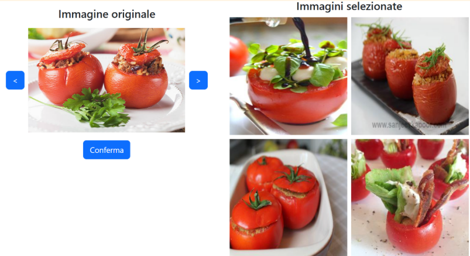
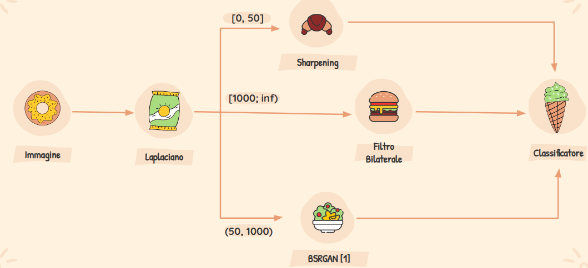
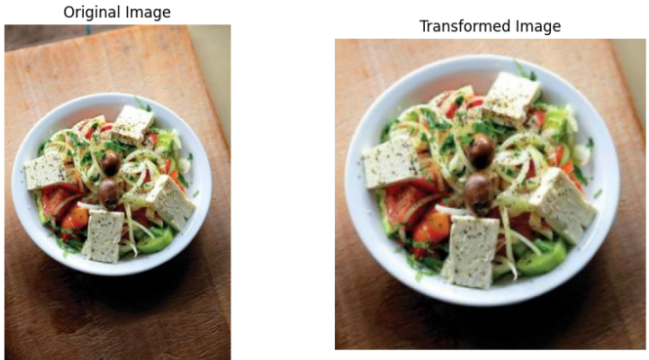
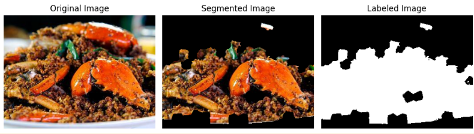
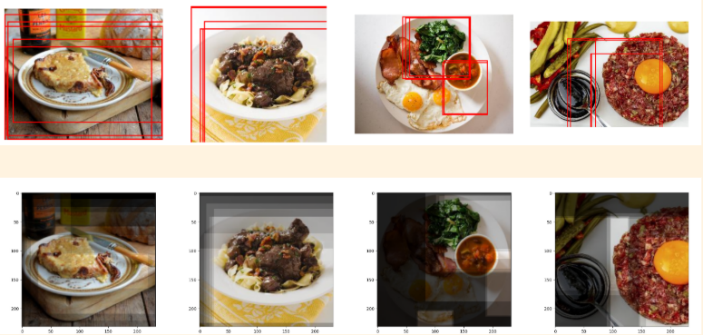

# FoodX-251 Classification

This repository contains the project developed for the **Master’s Degree in Visual Information Processing and Management** at the **University of Milan-Bicocca**.
The project focuses on the **fine-grained classification of food images** using traditional and deep-learning-based feature extraction techniques, model training, and performance enhancement strategies.

---

## 📂 Dataset Overview

The dataset used in this project is based on the **FoodX-251** dataset and includes:

- **251 food classes**
- **5,020 labeled training images** (20 per class)
- **112,455 unlabeled images**
- **11,994 clean test images**
- **11,994 degraded test images**

---

## 🧠 Models & Feature Extraction

We experimented with various feature extraction techniques and classifiers:

### 🔍 Feature Types

- **SIFT**
- **ResNet**
- **Color + LBP**
- **MobileNet V3**

### 📊 Classifiers

- **Random Forest**
- **K-Nearest Neighbors (KNN)**

The best performance was achieved using **KNN** with **MobileNet V3** features.

#### 🔥 Best Model Performance

| Test Set        | Top-1 Accuracy | Top-5 Accuracy |
| --------------- | -------------- | -------------- |
| Clean Images    | **26.09%**     | **51.58%**     |
| Degraded Images | **19.33%**     | **39.94%**     |

---

## 🚀 Performance Improvements

### 🔍 Outlier Removal with DBSCAN

Outliers were removed using **DBSCAN** clustering on MobileNet features, leading to a slight improvement:

- Degraded Top-5 Accuracy: **39.96%**

### 🧠 Content-Based Image Retrieval (CBIR)

We implemented a CBIR system using **KNN** and **class centroids** for retrieval.

#### CBIR Performance

| Test Set        | Top-1 Accuracy | Top-5 Accuracy |
| --------------- | -------------- | -------------- |
| Clean Images    | **28.90%**     | **54.99%**     |
| Degraded Images | **21.31%**     | **42.61%**     |

---

## 🔄 Data Augmentation

To bridge the gap between clean and degraded test sets, we introduced **noise-based augmentation** to simulate degradation.
This yielded slight improvements on degraded performance.

---

## 🧼 Degraded Data Cleaning Pipeline

We developed a **cleaning pipeline** to restore image quality.

---

## ✂️ Image Preprocessing Techniques

### 1. **Crop and Resize**

Most food objects were centered in images, so cropping and resizing were applied to improve focus on the subject.

### 2. **Segmentation**

We applied a segmentation pipeline to isolate food items from the background using the following steps:

1. **Superpixel Computation**
   The image is first divided into superpixels to capture perceptually similar regions.

2. **Feature Extraction from Each Superpixel**
   For each superpixel, we extract:

   - **Color Features**
   - **Local Binary Patterns (LBP)**

3. **Clustering with K-Means (k = 2)**
   We use K-Means clustering to group the superpixels into two clusters (foreground vs. background), effectively **binarizing** the image.

4. **Mask Application**
   The resulting binary mask is applied to the original image to **extract the food region**.

### 3. **Object Proposal**

Region proposal techniques were used to better capture and classify relevant parts of the image (Faster-RCNN).

---

## ✅ Project Tasks

The project addressed the following mandatory components:

1. **Initial Model Training** using the labeled training set (20 images/class)
2. **Data Augmentation** using the unlabeled image pool
3. **Fine-Grained Classification** of 251 food classes
4. **Classification of Degraded Images**
5. **Objective Performance Assessment**
6. **Visual Analysis of Key Results**
7. **Comparative Analysis** of all strategies
